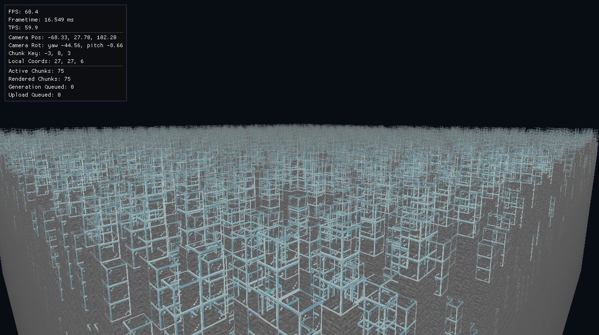
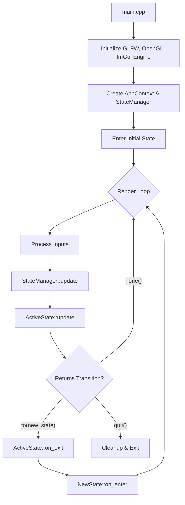
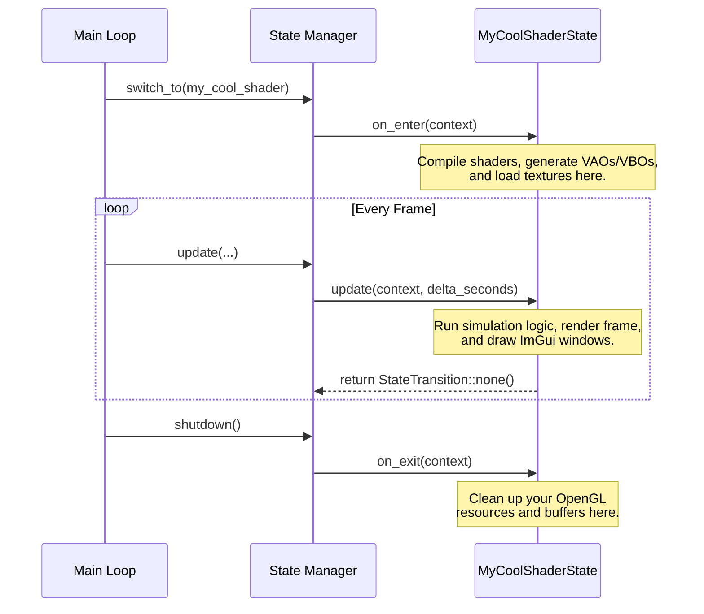
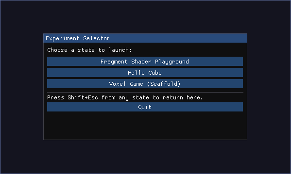
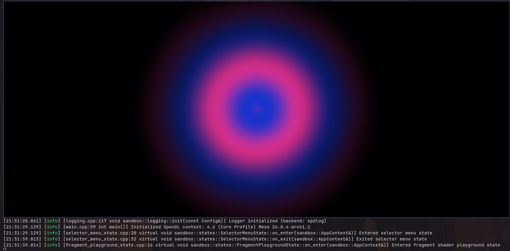
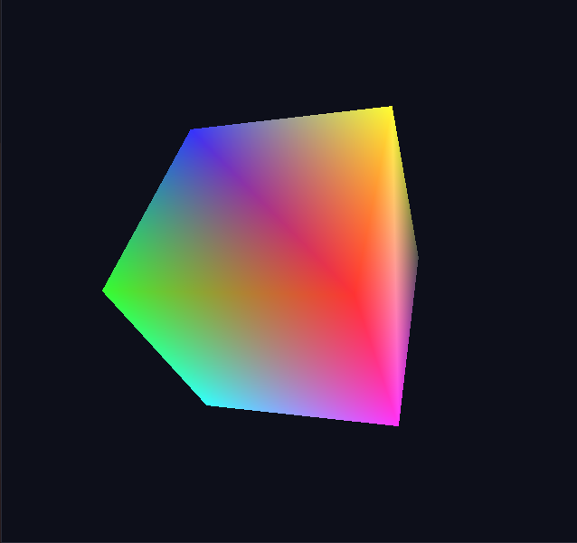

# OpenGL Sandbox



Starter C++23 OpenGL 4.6 project using GLFW + GLAD with CMake. Includes a simple state management system for easily creating and switching between different graphical experiments. The project is designed to be a sandbox for learning and prototyping graphics programming concepts without the overhead of setting up the boilerplate code every time. Screenshots at [the bottom](#screenshots) show some example states that have been implemented, including a fragment shader playground and a full fledged multithreaded voxel engine.

## Abstract

When starting to learn graphics programming, beginners face a significant barrier to entry. Before you can even begin to explore the most interesting parts—such as shaders, lighting models, physics, and simulations—you are forced to navigate a maze of boilerplate. This includes:
- Choosing the right combination of libraries and technologies
- Setting up the build system (e.g., CMake)
- Handling window creation and OpenGL context initialization
- Designing application architecture and the main loop
- Building out utility pipelines for loading and compiling shaders

Every time you want to build a new graphics experiment, you often have to rewrite or copy-paste this tedious setup all over again.

Many solutions exist to circumvent this: web-based environments like Shadertoy are excellent but restrict you to fragment shaders and hide the host-side C++ architecture. Full-scale game engines like Unity or Unreal are incredibly powerful but abstract the underlying graphics API away entirely, defeating the purpose of learning the low-level mechanics.

**OpenGL Sandbox** bridges this gap. It is a lightweight, pre-configured C++23 framework that takes care of the boilerplate (GLFW, GLAD, ImGui, and core utilities) so you can focus on the fun parts. Using a simple [State pattern](https://refactoring.guru/design-patterns/state), you can seamlessly create isolated graphical experiments—ranging from simple 2D fragment shader playgrounds to complex multi-chunk 3D voxel engines—all within the same project. 

It's simple to get started:

1. Fork the repo
2. Look at how the example states are implemented
3. Write your own experiments!

Some ideas for states you could implement:
- A ray marching sandbox for exploring procedural 3D scenes
- A physics simulation state with interactive controls (try integrating Jolt Physics!)
- A compute shader playground for GPGPU experiments
- A post-processing effects playground to experiment with bloom, motion blur, etc.
- A mesh-shader sandbox for testing out new rendering techniques (via NV_mesh_shader extension)

## Architecture & Quickstart

**OpenGL Sandbox** is built around a simple State Machine pattern. This keeps each experiment completely isolated from the others while sharing the same window and OpenGL context.

### The Game Loop

At a high-level, the application initializes the window, creates an `AppContext`, and hands control over to the `StateManager`. The `StateManager` updates your current `State` (experiment) every frame until a transition is requested.



### Implementing a New Experiment

Creating a new graphics experiment is incredibly straightforward.

**1. Create a Header (e.g., `my_cool_shader_state.hpp`)**:
Inherit from the `sandbox::State` base class.

```cpp
#pragma once
#include "sandbox/state.hpp"

namespace sandbox {
class MyCoolShaderState : public State {
public:
    void on_enter(AppContext& context) override;
    void on_exit(AppContext& context) override;
    StateTransition update(AppContext& context, float delta_seconds) override;
};
}
```

**2. Add the State to `AppStateId`**:
Edit `include/sandbox/state.hpp` and add your state to the enum.

```cpp
enum class AppStateId {
    selector_menu,
    // ...
    my_cool_shader // Add yours here!
};
```

**3. Implement the State Logic**:
In your `.cpp` file, implement the setup, main loop, and teardown logic. The sandbox manages the window frame cycle; you just draw to it!



**4. Register and Run**:
In `src/sandbox/state_manager.cpp`, register your new state in the `make_state` factory method. When the state completes its goal or the user wants to leave (handled by default via `Shift+Esc` going back to the selector), return `StateTransition::to(AppStateId::selector_menu)` or let the app context gracefully handle the shortcut.

## Requirements

- CMake 3.20+
- C++ compiler with C++23 support
- Python 3 (used by GLAD code generation during CMake configure/build)
- OpenGL 4.6 compatible GPU and drivers

### Dependencies

- [GLFW](https://www.glfw.org/) for window and input management
- [GLAD](https://glad.dav1d.de/) for OpenGL function loading
- [ImGui](https://github.com/ocornut/imgui) for immediate mode GUI
- [stb_image](https://github.com/nothings/stb) for image loading
- [glm](https://github.com/g-truc/glm) for mathematical operations
- [spdlog](https://github.com/gabime/spdlog) for logging

## Clone and initialize submodules

```bash
git submodule update --init --depth 1 --recursive
```

## Build

```bash
cmake -S . -B build -DCMAKE_BUILD_TYPE=Debug
cmake --build build -j
```

## Run

```bash
./build/opengl_sandbox
```

## Screenshots





## Documentation

- [Voxel Engine / Game Master Plan](docs/voxel-engine-planning.md)

